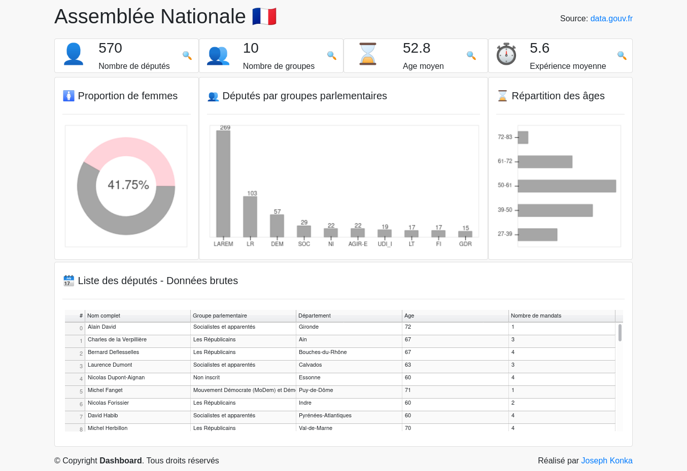

# deputes-fr - Assemblée Nationale Française 🇫🇷

Hello, I'm [Joseph Konka](https://www.linkedin.com/in/joseph-koami-konka/), Python enthousiast. In this porject, I've built a dashboard with France parliament. You can see the result [here](https://deputes-fr-jk.herokuapp.com/)

## Setup environment
```sh
python3 -m venv env
source env/bin/activate
pip install -r requirements.txt
```

## Launch
```sh
make launch
```

## Let's get in touch
[](https://www.facebook.com/josephkonka1999) [](https://www.linkedin.com/in/joseph-koami-konka/) [](https://www.twitter.com/joekakone) [](mailto:joseph.kakone@gmail.com)
